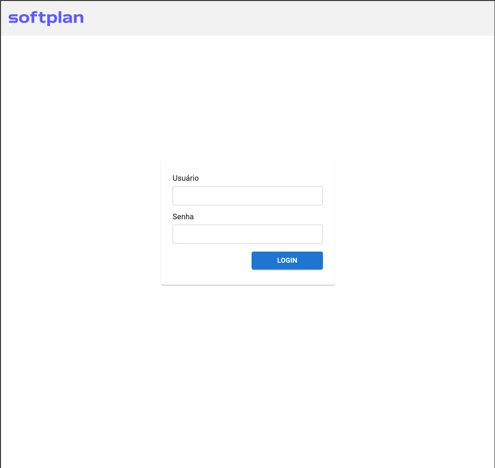

# Softplan Challenge UNIC

Este projeto foi desenvolvido para avaliação do processo seletivo para desenvolvedor da UNIC.

## 🚀 Instalação de Dependências

```bash
yarn install
```

## ⚡️ Executando a Aplicação

```bash
yarn start
```

## Usando a Aplicação

Ao acessar a aplicação, o usuário será direcionado automaticamente para uma tela de login, onde temos a princípio dois usuários pré-cadastrados que podem ser utilizados com o seguinte acesso:


Usuário com acesso `ADMIN` (completo):

```
Usuário: admin
Senha: admin
```

Usuário com acesso `USER` (limitado)

```
Usuário: user
Senha: user
```
