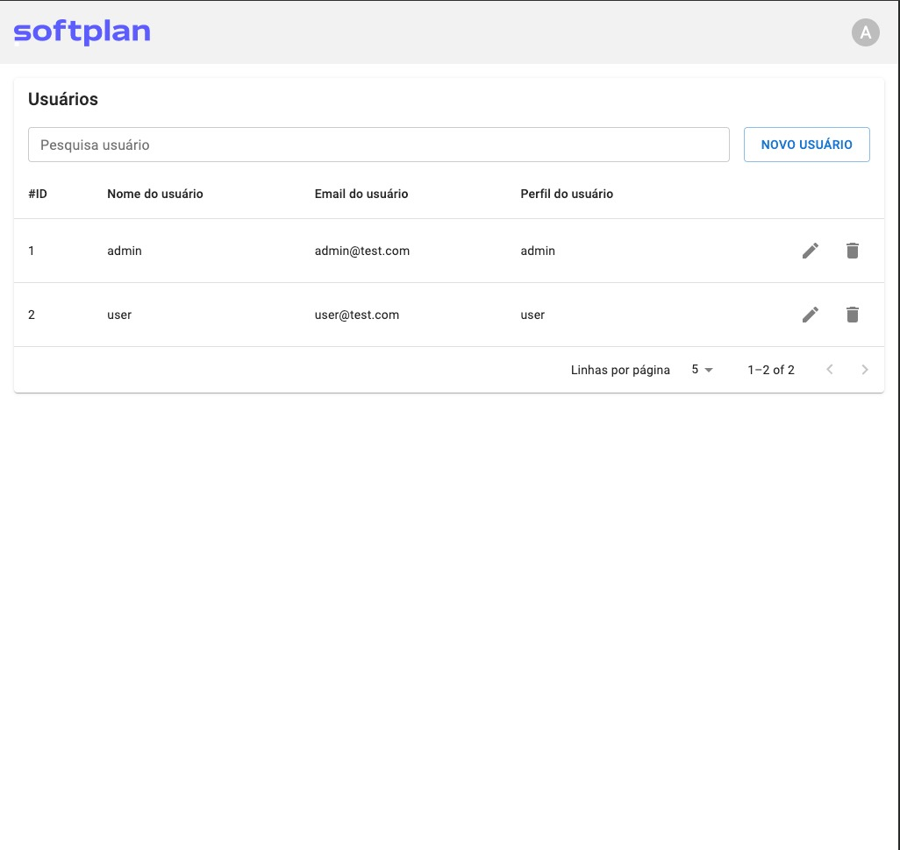
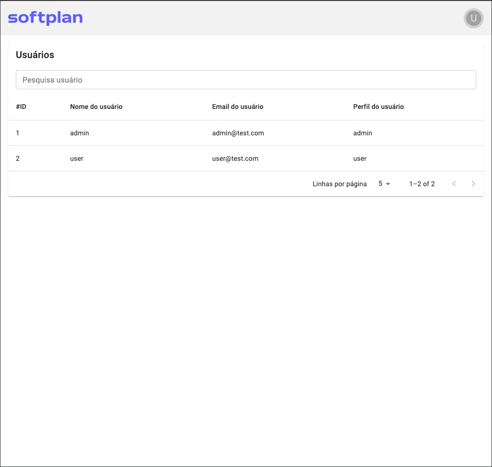
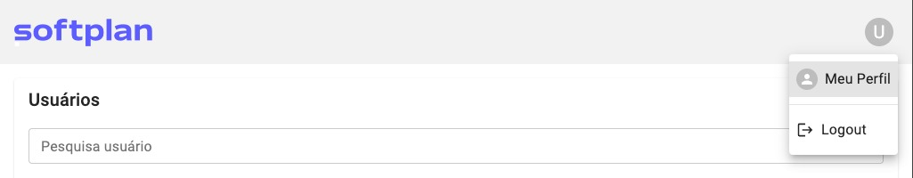
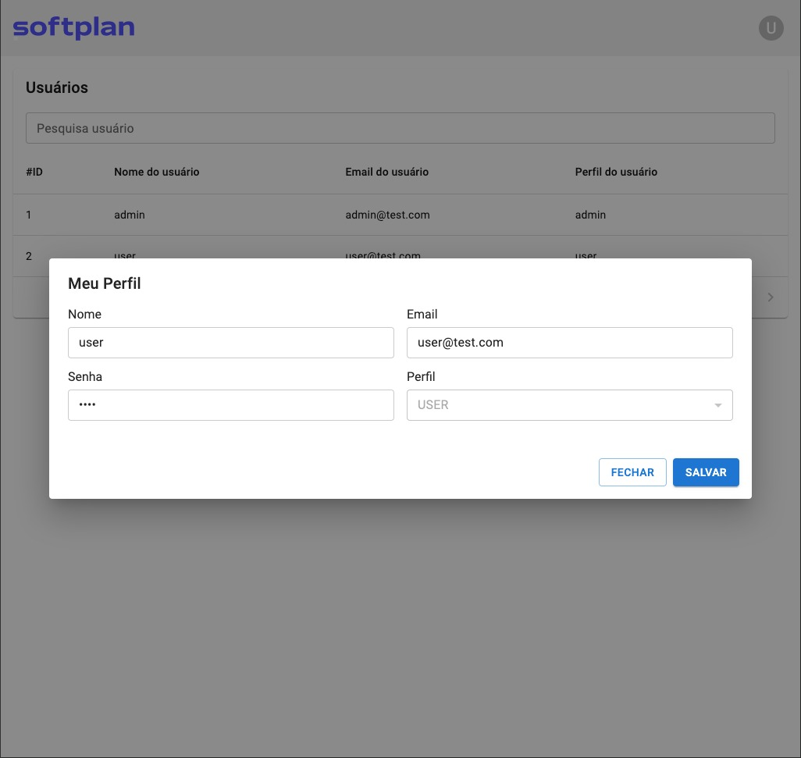
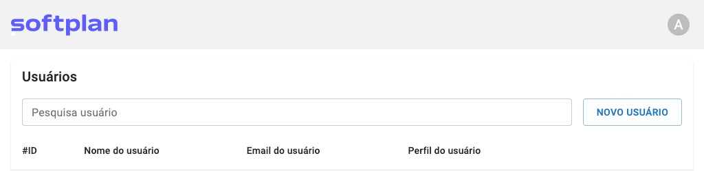
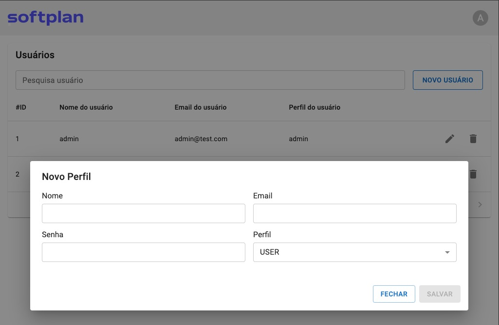

# Softplan Challenge UNIC

Este projeto foi desenvolvido para avaliação do processo seletivo para desenvolvedor da UNIC.

## 🚀 Instalação de Dependências

```bash
yarn install
```

## ⚡️ Executando a Aplicação

```bash
yarn start
```

## Usando a Aplicação

Ao acessar a aplicação, o usuário será direcionado automaticamente para uma tela de login, onde temos a princípio dois usuários pré-cadastrados que podem ser utilizados com o seguinte acesso:


Usuário com acesso `ADMIN` (completo):

```
Usuário: admin
Senha: admin
```

Usuário com acesso `USER` (limitado)

```
Usuário: user
Senha: user
```

O usuário que tem acesso `ADMIN` pode executar ações como:

- Criar um novo usuário
- Editar um usuário
- Excluir um usuário
- Consultar usuários
  

O usuário que tem acesso `USER` pode executar ações como:

- Editar seu próprio perfil, com exceção de mudar a si próprio para um usuário de nível `ADMIN`
- Consultar outros usuários
  

### Editando o próprio perfil

Para que um usuário possa editar seu próprio perfil, basta ele clicar no Avatar que contém a inicial do seu usuário, no canto superior direito da tela e clicar em `Meu Perfil`:


E depois disso um modal irá se abrir onde o usuário poderá fazer as edições que desejar:



### Cadastrando um novo usuário

Para que um usuário de nível `ADMIN` possa cadastrar um outro usuário, ele deve clicar no botao `NOVO USUARIO` ao lado direito da barra de pesquisa:


E depois disso um modal irá se abrir onde o usuário poderá adicionar um novo usuário:

